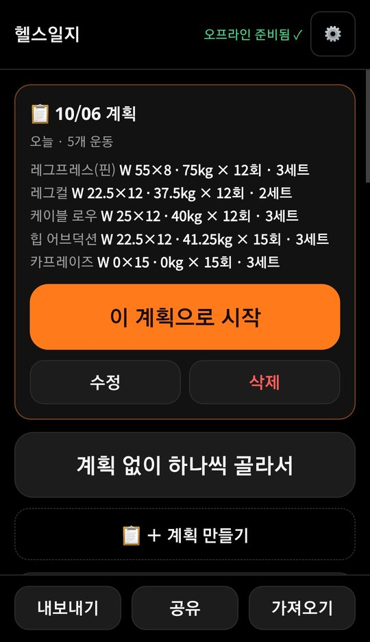
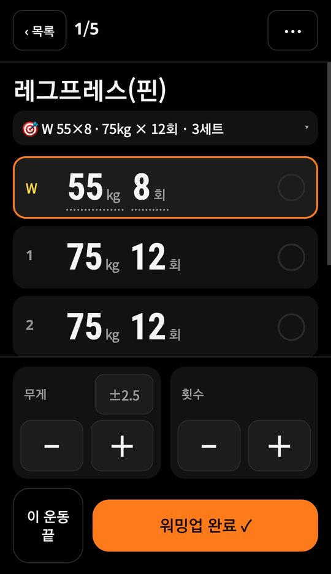
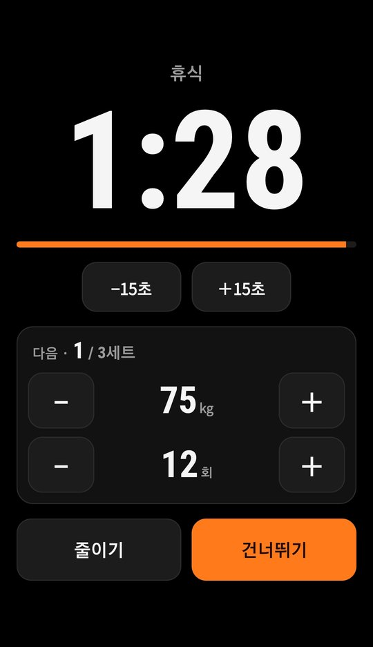
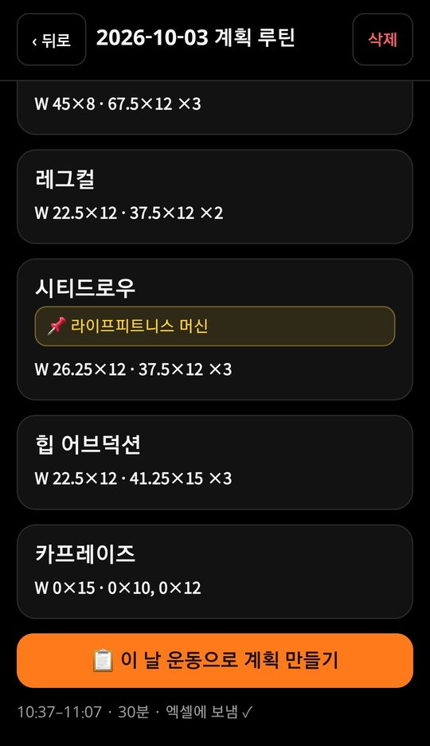

<div align="center">

# 🏋️ 헬스일지

**헬스장 오프라인 운동 기록 PWA + LLM 운동 코치**

   

</div>

<br />

## 💁🏻‍♂️ 소개

> 헬스장에서 세트마다 무게·횟수를 기록하는 오프라인 앱.<br>
> HTML 파일 하나짜리 PWA — 폰 홈 화면에 설치하면 인터넷 없이 동작하고, 집 Wi-Fi에서 버튼 한 번으로 엑셀에 쌓임.<br>
> PC의 LLM 코치가 엑셀 기록을 읽어 다음 운동 계획을 생성하고, 폰은 그 계획을 받아 헬스장에서 오프라인으로 진행.

- 기억·엑셀 수기 입력 대체 목적. 안 쓰는 갤럭시 S9을 헬스 전용 기기로 사용
- 기록 원본은 엑셀(`헬스일지.xlsx`). 볼륨·1RM·대시보드는 시트 수식이 계산
- 1인 사용 전제 — 서버·DB 없이 PC 한 대 + 폰 한 대

| **홈 · 오늘 계획** | **세트 기록** |
| :---: | :---: |
|  |  |
| **휴식 타이머** | **지난 기록** |
|  |  |

<br />

## 🦾 기능

### 📴 오프라인 기록
서비스워커 캐시 + 폰 로컬 저장. 유심 없는 공기계에서도 동작.

### 🔢 지난 기록이 기본값
운동 진입 시 지난번 무게·횟수가 세트별로 채워짐. 그대로 수행했으면 ✓만.

### ⏱️ 휴식 타이머
세트 완료 시 자동 시작. 타이머 화면에서 다음 세트 무게·횟수를 바로 수정. 마지막 10초 깜빡임, 종료 시 진동+소리.

### 📋 계획대로 진행
폰에서 작성(지난 기록 복사 가능)하거나 PC의 `plan.json`을 수신. 지난 계획은 2주간 "밀린 계획"으로 유지.

### 🤖 LLM 운동 코치
엑셀 기록 → Claude API → 다음 운동 계획. 증량 한도·부상 규칙은 파이썬 가드레일이 강제. → [상세](#-llm-운동-코치)

### 📥 엑셀 양방향 동기화
- 폰 → 엑셀: 집 Wi-Fi에서 전송 시 [기록] 시트에 한 운동 = 한 줄 추가
- 엑셀 → 폰: 앱 실행 시 운동목록·기록을 받아와 맞춤. 엑셀에서 정정한 이름·메모도 반영

### 그 밖에
유산소(거리·시간·페이스) · 운동별 고정 메모 · 그날 메모 · 원판 한쪽 무게 표시 · JSON 내보내기/가져오기

<br />

## 🤖 LLM 운동 코치

원칙: **LLM은 제안, 규칙은 코드가 강제.** 앱의 오프라인 구조는 그대로 두고 PC 쪽에만 추가.

```
[집 PC]  python coach.py --date 2026-10-08 --note "허리 약간 뻐근"
   ① 엑셀 읽기 (sync_excel.read_excel 재사용)
   ② 컨텍스트 생성 — 최근 6주 기록·지난 세트·증량 가능 무게·부위별 마지막 날짜를 파이썬이 계산
   ③ Claude API 호출 — 구조화 출력(JSON 스키마, 운동 이름은 enum)으로 계획만 받음
   ④ 가드레일 validate() — 규칙 위반은 고치고 [자동수정] 표시
   ⑤ plan.json 병합 저장 + coach_log 기록
[폰]   집 Wi-Fi에서 앱 실행 시 계획 수신 → 헬스장에선 오프라인으로 진행
```

### 가드레일

계산은 LLM에 맡기지 않음 — 지난 세트, 범위 상단 도달 여부, 이번에 쓸 수 있는 최대 무게(`next_kg_max`)를 파이썬이 계산해서 전달. LLM 출력 뒤에서 아래 규칙을 강제.

| | 규칙 | 위반 시 |
| :--- | :--- | :--- |
| G1 | 운동목록에 있는 운동만 | 삭제 |
| G2 | 무게 ≤ 지난번 최고 + 증량 단위 | 상한으로 깎음 |
| G3 | 통증 메모(오늘 요청·최근 7일 메모·그 운동 지난 메모)가 가리키는 부위는 증량 0. `통증 없음` 등 부정문 제외 | 지난 무게로 |
| G4 | 세트 1~6, 횟수 1~30 (플랭크 등 초 단위 예외) | 범위로 자름 |
| G5 | 예상 시간 ≤ 시간 예산 × 1.2 | 뒤 운동부터 세트 축소 |
| G6 | 그날 이미 한 운동과 중복 | 경고만 |
| G7 | 지난번 범위 상단 미달이면 무게 유지 | 지난 무게로 |

G7은 후속 추가. 첫 실행에서 LLM이 상단 미달 운동 3개를 한 단계씩 증량 → G2(지난번 + 1단계 이하)로는 통과됨. `next_kg_max`를 컨텍스트에 넣고 G7 추가 → 재실행 시 위반 0건.

### 모델 선택

같은 입력으로 1회씩 비교.

| 모델 | 1회 비용·시간 | 결과 |
| :--- | :--- | :--- |
| Claude Haiku 4.5 | 약 $0.014 · 16초 | 허리 통증 요청에도 루마니안 데드리프트 포함, 사실과 다른 근거 |
| **Claude Sonnet 5.5** (채택) | 약 $0.05 · 26~30초 | 근거 날짜·무게 정확, 부상 부위 운동 제외 |

### 기타

- **API 키** — PC 환경변수에만 보관. `serve.py`가 폴더 전체를 서빙하므로 개인 설정·로그·`.py`·점파일은 404 처리 (실제 파일 경로 기준 판정 — 대소문자·`%` 인코딩·`..` 우회 차단)
- **호출 로그** — 호출마다 `coach_log/`에 입력 컨텍스트 전체·LLM 원문·수정 전/후 계획·가드레일 수정·토큰·비용·지연·프롬프트 버전 기록. 프롬프트·모델 비교(Eval) 재료
- **테스트 31개** — 규칙별 가짜 LLM 출력, `plan.json` 병합·백업, 로그(가짜 LLM으로 전체 실행, API 비용 없음). 규칙을 끄면 해당 테스트가 실패하는 것까지 확인
- **설계 문서** — [docs/LLM코치_1단계_설계.md](docs/LLM코치_1단계_설계.md)

> **개발 방식** — Claude Code(AI 코딩 도구) 사용. 코드·테스트 작성은 주로 Claude Code, 요구사항·방향 결정(모델·가드레일)·실기기 검증은 본인.

<br />

## 🤓 시작하기

**Prerequisites**

- Python 3.10+
- 같은 Wi-Fi의 안드로이드 폰 (삼성 인터넷 또는 크롬)
- (코치 사용 시) Anthropic API 키 → 환경변수 `ANTHROPIC_API_KEY`

**PC에서 실행**

```bash
# 의존성 설치
pip install openpyxl anthropic

# 서버 실행 → 폰에서 http://<PC IP>:8123
python serve.py

# 연습용: 동기화를 헬스일지_테스트.xlsx 에
python serve.py --test

# 코치: 넘길 컨텍스트만 확인 (LLM 호출 없음)
python coach.py --date 2026-10-08 --context

# 코치: 계획 출력만
python coach.py --date 2026-10-08 --note "허리 뻐근" --dry-run

# 코치: plan.json 에 저장 (같은 날짜 AI 계획은 교체)
python coach.py --date 2026-10-08 --focus 하체

# 테스트
python -m unittest discover -s tests
```

- 엑셀(`헬스일지.xlsx`)·`백업/` 위치 기본값은 앱 폴더의 상위 폴더. 다른 곳이면 `local_config.json`(git 제외)에 `{"data_dir": "D:/헬스/운동"}` 또는 환경변수 `GYMLOG_DATA`
- 코치 개인 설정(목표·부상·주당 횟수·시간)은 `coach_profile.json`(git 제외). 형식은 `coach_profile.example.json`

**폰에 설치** (최초 1회, 같은 Wi-Fi)

1. 폰 브라우저에서 `http://<PC IP>:8123` 열기
2. 메뉴 → **홈 화면에 추가**
3. 상단에 **오프라인 준비됨 ✓** 표시되면 완료. 이후 PC 꺼도 됨

> ⚠️ **PC IP 고정 필요.** 설치된 앱은 설치 당시 주소를 기억함. IP가 바뀌면 동기화·앱 갱신 불가 → 수동 IP 설정 또는 공유기 DHCP 예약.
> 크롬에서 안 되면 `chrome://flags/#unsafely-treat-insecure-origin-as-secure`에 주소 추가.

<br />

## 📚 기술 스택

| 역할 | 종류 |
| :--- | :--- |
| App |    — 의존성 없는 단일 파일, Service Worker |
| PC 서버·동기화 |  — `http.server`, `openpyxl` |
| LLM |  — Sonnet 5.5, 구조화 출력 |
| 데이터 |  — 기록 원본 |
| 테스트 | `unittest` |

<br />

## 📂 폴더 구조

```
├── 📜 index.html            앱 전체 (HTML/CSS/JS 단일 파일)
├── 📜 sw.js                 오프라인 캐시 (index.html 수정 시 VER 올림)
├── 📜 manifest.webmanifest  홈 화면 설치
├── 🐍 serve.py              폰용 서버 + /api/sync(폰→엑셀) · /api/excel(엑셀→폰) · 비공개 경로 차단
├── 🐍 sync_excel.py         앱 기록(JSON) ↔ 엑셀
├── 🐍 coach.py              LLM 코치 (컨텍스트 → Claude API → 가드레일 → plan.json)
├── 📂 tests                 가드레일·저장·로그 테스트
├── 📂 docs                  설계 문서 · 스크린샷
├── 📜 coach_profile.example.json
│
│   ── git 제외 (개인 데이터) ──
├── 📜 plan.json             운동 계획 (홈 카드)
├── 📜 seed.json             엑셀에 있던 과거 기록 (첫 실행 때 1회 들여옴)
├── 📜 coach_profile.json    목표·부상·시간 예산
├── 📜 local_config.json     엑셀 위치
└── 📂 coach_log             코치 호출 로그
```

<br />

## 📝 데이터 형식

<details>
<summary><b>plan.json</b> — 운동 계획</summary>

```json
{
  "plans": [
    {
      "id": "2026-09-25",
      "date": "2026-09-25",
      "title": "9/25 루틴",
      "note": "허리 조심 · 무게보다 자세 먼저",
      "items": [
        { "ex": "레그프레스(원판)", "warm": { "kg": 20, "reps": 12 }, "kg": 40, "reps": 12, "sets": 3, "note": "얕게 · 허리 붙인 채" },
        { "ex": "레그컬", "kg": null, "reps": 12, "sets": 2, "note": "가볍게" },
        { "ex": "바이셉스 컬", "kg": 15, "reps": 8, "repsText": "8~10", "sets": 3 }
      ]
    }
  ]
}
```

- `ex` — [운동목록]의 이름 (없으면 새 운동으로 추가)
- `warm` — 워밍업 세트. `{ "kg", "reps" }`면 그 값, `false`면 워밍업 없음, 생략하면 지난번 워밍업
- `kg` — `null`이면 지난번 무게 그대로
- `repsText` — `8~10`처럼 표시용 문구, `reps`는 미리 채울 숫자
- AI 코치 계획은 `id`가 `ai-YYYY-MM-DD`. 같은 id는 교체, 손으로 쓴 계획은 유지
- 시작 후에는 무게·세트·운동 자유롭게 변경 가능 (계획은 참고용)

</details>

<details>
<summary><b>엑셀 동기화</b> — 시트 구조와 규칙</summary>

- [기록] 시트: `A날짜 · C운동 · E,F워밍업 · G~R 1~6세트 kg/회 · W메모` (헤더 2줄, 데이터 3행부터)
- [활동] 시트(유산소): `A날짜 C종류 D거리 E시간 G강도 H장소 I메모`
- 운동별 메모는 그 줄 W열, 그날 메모는 첫 줄에 `[오늘] …`
- 시작·종료 시각은 그날 첫 줄 AI·AJ 열 (AK 운동(분)은 수식). 종료 = 마지막 세트 ✓ 시각
- 운동 고정 메모는 [운동목록] F열 뒤에 `[폰] …`. 기존 글은 유지하고 `[폰]` 뒤쪽만 갱신
- 쓰기 전 `백업/`에 사본(최근 10개), 보낸 세션 id는 `synced.json`에 기록해 중복 방지
- 서버 없이: 앱에서 내보낸 JSON을 `python sync_excel.py 헬스일지_날짜.json`
- 폰 기록 저장 형태(`localStorage`): `{sessions:[{date, entries:[{ex, warm:{kg,reps}, sets:[{kg,reps}], memo}]}]}`

</details>

<br />

## 🗺️ 앞으로

- [ ] AI 코치 계획으로 실제 운동 2~3회 검증 (진행 중)
- [ ] 앱에서 "AI 계획 받기" 버튼 (온라인일 때만, 실패 시 기존 계획 유지)
- [ ] Eval — 고정 입력 세트로 규칙 위반률·계획 품질 측정, 프롬프트·모델 비교
- [ ] 루틴·운동 목록을 앱 안에서 편집
- [ ] 운동별 무게 추이 그래프
- [ ] 부위별 마지막으로 한 날
